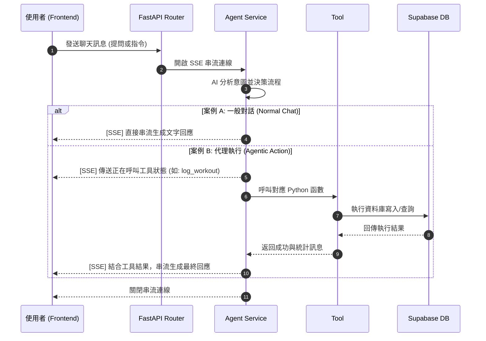

# GentleGains - 健身與營養 AI 智慧平台

是一個整合 **FastAPI** 與 **Next.js** 的網站系統，透過生成式 AI 實現自動化的健身與營養管理。使用者能透過系統平台記錄運動與飲食，或與 AI Chatbot 即時對話，由 AI 分析健康狀態，或進行各式操作。

## 系統模組

| 模組 | 主要功能 | 描述 |
| :--- | :--- | :--- |
| **Workout Log** | 手動記錄健身數據 | 支援輸入動作、重量與組次；系統自動將數據保存至資料庫。 |
| **Food Log** | Vision 分析 & 營養建議 | 利用 GPT-4o Vision 自動分析飲食圖片，估算熱量與營養素。 |
| **AI Chatbot** | 即時教練對話 | 由 LLM 進行訓練或飲食評估，並串接多項 Tools 執行自動化記錄。 |

## 🤖 AI Chatbot 
AI Agent 擔任健身教練，以 **GPT-4o** 為模型。使用者能即時與 Agent 討論健身計劃或飲食內容，Agent 串接多個 Tools，使 Agent 具備自主代理功能。

### Flow


## 🛠️ 技術堆疊 (Tech Stack)

| 領域 | 技術項目 | 說明 |
| :--- | :--- | :--- |
| **Agent** | OpenAI GPT-4o | 負責語義理解、工具執行與 Vision 圖片解析。 |
| **Backend** | FastAPI (Python) | 利用非同步 (Async) 特性實作 SSE 串流與邏輯控制。 |
| **Frontend** | Next.js 15 (React 19) | 採用現代化組件架構。 |
| **Database** | Supabase (PostgreSQL) | 提供資料存取層與後續擴展之向量儲存。 |
| **驗證層** | Pydantic | 嚴格規範 AI 輸出的資料格式，確保寫入安全性。 |

### 🚀 核心技術
*   **Tool Use**：具備從自然語言指令中提取參數並主動操作資料庫的能力。未來將持續，並計畫透過 MCP Server 對接外部服務（如 Google 日曆）。
*   **SSE 即時串流 (Streaming)**：實現 LLM 生成過程與工具執行狀態的零延遲回應，優化使用者等待體驗。
*   **後端三層架構**：採用 `Router -> Service -> Repository` 模式，讓商業邏輯與資料存取層解耦。

## 🌲 File Tree

```text
GentleGains/
├── backend/                # FastAPI 後端服務
│   ├── app/
│   │   ├── data/           # Repository 負責資料庫操作與 Schema 驗證
│   │   ├── services/       # Agent 核心服務邏輯
│   │   ├── tools/          # Agent 呼叫之工具定義
│   │   └── router/         # API Endpoint 端點定義
│   └── main.py             # Server 啟動入口
├── frontend/               # Next.js 前端應用
│   ├── app/                # App Router 目錄結構
│   │   ├── chat/           # AI 聊天室頁面
│   │   ├── workouts/       # 健身紀錄模組
│   │   └── food/           # 飲食分析模組        
└── README.md               # 專案技術說明文件
```

### 🔹 Backend - FastAPI
採用分層架構：
-   `app/router/`：定義對外的 RESTful API，負責接收前端請求並派發至 Service。
-   `app/services/`：
    -   `agent_service.py`：協調 AI Agent 生成、管理對話歷史及工具執行狀態。
    -   `ai_service.py`：封裝 Vision 分析功能，處理食物圖片並產出營養數據建議。
-   `app/tools/`：定義 Agent 可直接調用的工具函數 (Python Functions)。
-   `app/data/`：
    -   `repositories.py`：封裝 Supabase SDK，集中管理 CRUD 操作。
    -   `schema.py`：使用 Pydantic Model 確保資料交換的正確性。

### 🔹 Frontend - Next.js
-   `app/chat/`：實作即時串流 UI，包含 SSE 解碼與訊息動態滾動效果。
-   `app/workouts/`：健身日誌管理中心，支援歷史數據瀏覽與手動資料補齊。
-   `app/food/`：整合圖片分析與營養熱量統計顯示。

## Quick Start

### 環境配置
分別在 `backend` 與 `frontend` 目錄下建立 `.env` 檔案：
-   `OPENAI_API_KEY`: 您的 OpenAI API Key。
-   `SUPABASE_URL` & `SUPABASE_KEY`: Supabase 專案連線資訊。

### 🔌 啟動後端服務
```bash
cd backend
pip install -r requirements.txt
python main.py
```
預設伺服器運行於 `http://127.0.0.1:8000`。

### 🌐 啟動前端應用
```bash
cd frontend
npm install
npm run dev
```
預設應用運行於 `http://127.0.0.1:3001`。

## ⚙️ Environment

* fastapi
* uvicorn
* openai
* pydantic
* python-dotenv
* supabase
* openai-agents==0.2.6
* httpx>=0.27.0,<0.28.0

## 🔑 Third-Party Licenses
本專案引用的第三方套件詳見 `backend/requirements.txt` 與 `frontend/package.json`。
