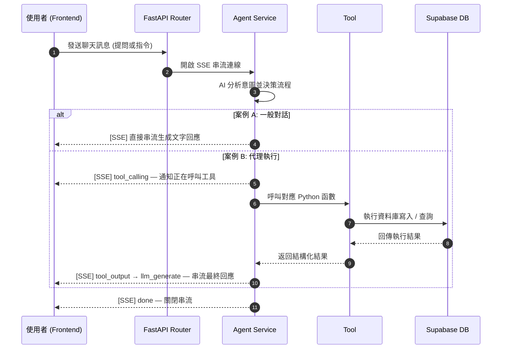

# GentleGains — AI 健身與營養管理平台

整合 **FastAPI** 與 **Next.js** 的全端應用，透過生成式 AI 實現自動化的健身與營養管理。使用者能透過平台記錄運動與飲食，或與 AI 教練即時對話，由 AI 分析健康狀態並執行各式代理操作。

## 系統模組

| 模組 | 主要功能 | 描述 |
| :--- | :--- | :--- |
| **Workout Log** | 手動記錄健身數據 | 支援輸入動作、部位、重量與組次，數據自動寫入資料庫。 |
| **Food Log** | Vision 分析 & 營養建議 | 利用 GPT-4o Vision 分析飲食圖片，估算熱量與三大營養素，並給予評分。 |
| **Dashboard** | 數據視覺化 | 以 Recharts 呈現營養攝取趨勢、訓練紀錄與身體部位分佈圖表。 |
| **AI Chatbot** | 即時教練對話 | GentleCoach Agent 串接多個工具，具備自主代理能力，可記錄訓練、分析飲食、安排行程與聯網搜尋。 |

## 🤖 GentleCoach Agent

AI Agent 擔任健身教練，以 **GPT-4o** 為核心模型。使用者能即時與 Agent 討論訓練計劃或飲食內容，Agent 根據語意意圖自動選擇並呼叫工具。

### Agent Tools

| 工具 | 功能 |
| :--- | :--- |
| `record_workout_exercise` | 將訓練動作（名稱、部位、重量、組次）寫入資料庫 |
| `analyze_workout_progress` | 查詢過往健身記錄，自動計算進步幅度與訓練分佈 |
| `record_food_intake_with_vision` | 分析使用者上傳的圖片，估算營養並寫入飲食記錄 |
| `schedule_appointment` | 透過 Google Calendar API 建立健身行程 |
| `web_search` | 透過 Tavily 聯網搜尋健身科學與營養資訊 |

### Chat Flow



## 🛠️ 技術堆疊

| 領域 | 技術 | 說明 |
| :--- | :--- | :--- |
| **Agent** | OpenAI GPT-4o + openai-agents | 語意理解、工具調用、Vision 圖片解析 |
| **Backend** | FastAPI (Python) | 非同步 SSE 串流、三層架構 Router → Service → Repository |
| **Frontend** | Next.js 15 (React 19) | 串流 UI、Recharts 圖表、Tailwind CSS |
| **Database** | Supabase (PostgreSQL) | 對話、訓練、飲食記錄的 CRUD |
| **觀測性** | LangSmith | Agent 執行追蹤，每次對話包裝在 `RunTree` trace 內 |
| **外部整合** | Google Calendar API、Tavily Search | 行程安排與即時聯網搜尋 |
| **資料驗證** | Pydantic | 嚴格規範 AI 輸出的資料格式 |

### 🚀 核心技術亮點

- **LangSmith Tracing**：Agent 執行流程以 `RunTree` 包裝，搭配 `wrap_openai` 自動攔截所有 LLM 呼叫，可在 [smith.langchain.com](https://smith.langchain.com) 查看完整 trace。
- **Agent Evaluation**：提供 `agent_evaluator.py` 與 `generate_eval_sample.py` 進行 Agent 品質評估，以 golden dataset 驗證工具呼叫正確性。
- **SSE 即時串流**：零延遲回傳 LLM 生成過程與工具執行狀態，優化使用者等待體驗。
- **Google OAuth 整合**：支援 OAuth 授權流程，透過 `GoogleManager` 管理 refresh token，Token 失效時自動引導重新授權。
- **多模態對話**：對話歷史支援圖文混合格式，圖片以 `ContextVar` 跨工具傳遞，避免跨請求污染。

## 🌲 File Tree

```text
GentleGains/
├── backend/
│   ├── app/
│   │   ├── router/api.py           # REST / SSE 端點定義
│   │   ├── services/
│   │   │   ├── agent_service.py    # Agent 協調、SSE 串流、LangSmith trace
│   │   │   ├── agent_instructions.py # GentleCoach 系統提示詞
│   │   │   ├── ai_service.py       # GPT-4o Vision 食物分析
│   │   │   ├── google_manager.py   # Google OAuth 與 Calendar 管理
│   │   │   └── context.py          # ContextVar 圖片 URL 傳遞
│   │   ├── tools/tools.py          # @function_tool 工具定義
│   │   └── data/
│   │       ├── repositories.py     # Supabase CRUD 操作
│   │       └── schema.py           # Pydantic 資料模型
│   ├── agent_evaluator.py          # Agent 評估腳本
│   ├── generate_eval_sample.py     # 評估樣本產生器
│   └── main.py                     # FastAPI 應用程式進入點
├── frontend/app/
│   ├── chat/page.js                # SSE 串流聊天室
│   ├── dashboard/page.js           # Recharts 數據儀表板
│   ├── food/add/page.js            # 飲食圖片上傳與分析
│   ├── workouts/add/page.js        # 手動健身記錄表單
│   └── sidebar.js                  # 全站側邊導覽列
└── README.md
```

## Quick Start

### 環境設定

在 `backend/` 建立 `.env`：

```env
OPENAI_API_KEY=
ANTHROPIC_API_KEY=
SUPABASE_URL=
SUPABASE_KEY=           # service role key
TAVILY_API_KEY=
LANGSMITH_API_KEY=
LANGSMITH_TRACING=true
LANGSMITH_PROJECT=gentle-gains
```

在 `frontend/` 建立 `.env`：

```env
NEXT_PUBLIC_SUPABASE_URL=
NEXT_PUBLIC_SUPABASE_ANON_KEY=
```

### 🔌 啟動後端

```bash
cd backend
python -m venv .venv && .venv\Scripts\activate
pip install -r requirements.txt
python main.py
# 預設伺服器運行於 http://127.0.0.1:8000
```

### 🌐 啟動前端

```bash
cd frontend
npm install
npm run dev
# 預設應用運行於  http://127.0.0.1:3001
```

### 評估 Agent 品質

```bash
cd backend
python generate_eval_sample.py   # 產生評估樣本
python agent_evaluator.py        # 完整評估
```

## Supabase 資料表

| 資料表 | 主要欄位 |
| :--- | :--- |
| `chat_messages` | `session_id`, `role`, `content`, `image_url`, `created_at` |
| `workout_logs` | `exercise_name`, `body_part`, `weight`, `sets`, `reps`, `created_at` |
| `food_logs` | `food_name`, `calories`, `protein`, `fat`, `carbs`, `score`, `meal_type`, `image_url`, `created_at` |
| `users` | 單一使用者 `tester_01` |

## 🔑 Third-Party Licenses
本專案引用的第三方套件詳見 `backend/requirements.txt` 與 `frontend/package.json`。
